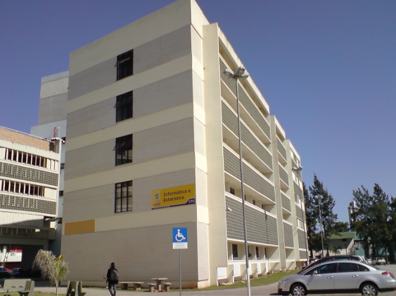
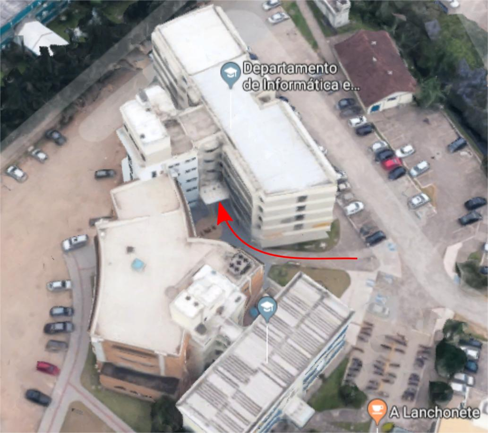

# Como chego ao local da matrícula?
A UFSC é cheia de pontos de ônibus. Se chegar a qualquer um deles, já está perto o suficiente pra ir caminhando. Como saber que ônibus pegar? Google Maps e Moovit podem ajudar (disponíveis na web e em apps).

## Validação de autodeclaração
Se você não ingressou por classificação geral, compareça primeiro ao Bloco B do [Centro Socioeconômico (CSE)](https://goo.gl/maps/GUgXKJLKA4kZfuBJ7) com a documentação necessária, **das 13h30 às 16h da segunda-feira (3)**.

## Matrícula

Pode ser feita em qualquer um dos cinco dias da semana (3~7 de fevereiro), das 8h às 12h e das 14h às 18h, na secretaria do curso, localizada no prédio do INE (Departamento de Informática e Estatística). Ele fica no meio do CTC (Centro Tecnológico), cercado por estacionamentos, e tem conexão com o prédio do ENS (Departamento de Engenharia Sanitária e Ambiental). A entrada fica entre os dois prédios, como a imagem a seguir mostra.

Perto da entrada do INE você deve encontrar alguns de nós do CALICO, prontos para ajudar com o que for necessário.
A secretaria fica no andar térreo: basta entrar no prédio, virar à direita duas vezes e seguir até o final do corredor. A última porta à direita é a secretaria. O secretário do lado direito da sala é responsável pelo nosso curso; o outro, por Sistemas de Informação.

INE no mapa: https://goo.gl/maps/ZGvG8mJaaQq6HvJg6

## Dúvidas?
Se precisar de qualquer ajuda, é só mandar uma mensagem pra um de nós: [@cauebs](https://t.me/@cauebs), [@coelhonix](https://t.me/@coelhonix), [@hansb21](https://t.me/@hansb21), [@lenaaires](https://t.me/@lenaaires), [@luckz16](https://t.me/@luckz16), [@luisow](https://t.me/@luisow), [@mdcroque](https://t.me/@mdcroque), [@mikaelsaraiva](https://t.me/@mikaelsaraiva), [@zankely](https://t.me/@zankely).

-- CALICO (Centro Acadêmico Livre da Computação)
